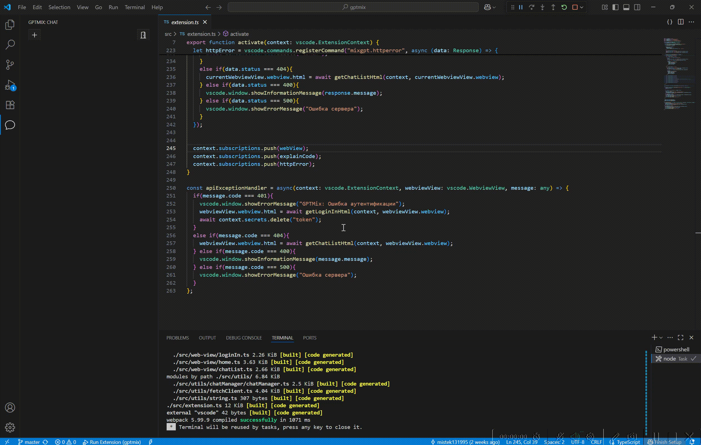
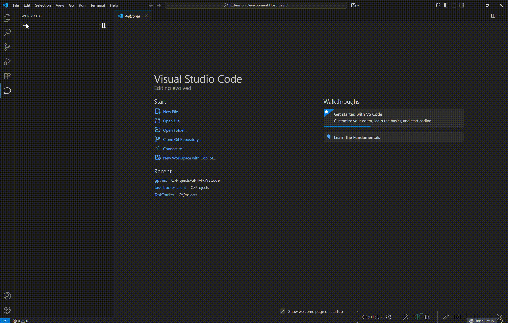

# MixGPT — AI чат для Visual Studio Code

**MixGPT** — это расширение для Visual Studio Code, позволяющее общаться с 10+ LLM-моделями (включая GPT, Claude, Mistral и другие) прямо в редакторе. Поддерживается переключение между моделями с сохранением контекста чата.

> 🔐 Подключение к сервису требует регистрации и токена: [https://mixgpt.ru](https://mixgpt.ru)

## 🚀 Возможности

- Поддержка более 10 языковых моделей
- Чат с сохранением истории
- Объяснение кода
- Переключение между моделями в рамках одного диалога
- Удобный интерфейс в панели VS Code
- Простое подключение через токен
- Отправка файлов проекта в чат

## 🛠 Установка

1. Установите расширение через Marketplace или `.vsix`:
   - [Marketplace](https://marketplace.visualstudio.com/items?itemName=MixGPT.mixgpt)
2. Перейдите в [https://mixgpt.ru](https://mixgpt.ru) и создайте аккаунт
3. Скопируйте токен доступа из профиля
4. В VS Code откройте MixGPT (иконка в левом тулбаре)
5. Вставьте токен при первом запуске

## 📞 Поддержка и ссылки

- 🌐 Сайт: [https://mixgpt.ru](https://mixgpt.ru)
- 📧 Поддержка: report@mixgpt.ru

## Примеры использования

## 📝 Лицензия

Расширение распространяется под лицензией **GPL-3.0**. См. файл [`LICENSE`](./LICENSE).